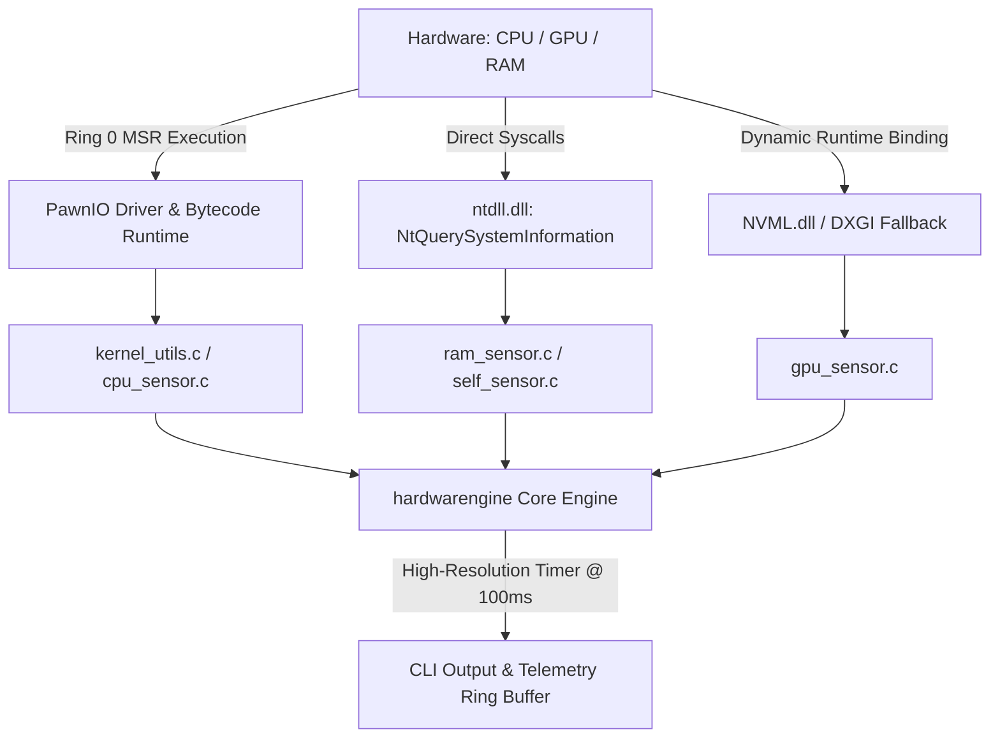

# hardwarengine

[-red.svg)](https://github.com/namazso/PawnIO)

**Microsecond-latency, zero-overhead low-level telemetry engine & in-game HUD backend for Windows x64.**

[English](README.md) • [Türkçe](README_TR.md)

---

## English

A low-level telemetry engine written in pure C99 designed to bypass slow, high-overhead abstractions (WMI, COM, CIM). Direct access to Ring 0 Model-Specific Registers (MSR), native Windows NT syscalls, and dynamic hardware driver bindings to extract true hardware operational metrics with near-zero latency and minimal CPU/RAM footprint.

### System Architecture & Data Flow

### Telemetry Pipeline & Metric Specifications

| Subsystem | Metric | Primary Source / Mechanism | Latency Target | Overhead |
| --- | --- | --- | --- | --- |
| **CPU Core** | Real Effective Clock | MSR (`IA32_APERF` / `IA32_MPERF`) | Sub-microsecond | $\approx 0$ cycles |
| **CPU Thermal** | Core / Package Temp | MSR (`IA32_THERM_STATUS` + TjMax) | Sub-microsecond | $\approx 0$ cycles |
| **CPU Power** | Core VID / Voltage | MSR (`IA32_PERF_STATUS` / AMD P-State) | Sub-microsecond | $\approx 0$ cycles |
| **CPU Load** | Kernel / User Deltas | `NtQuerySystemInformation` (Native NT API) | $< 10\,\mu\text{s}$ | Zero allocation |
| **GPU (Discrete)** | Clocks, Temp, VRAM, Power | NVML Dynamic Runtime API (`nvml.dll`) | $< 50\,\mu\text{s}$ | Dynamic load |
| **System Memory** | Physical RAM In-Use / Free | `GlobalMemoryStatusEx` | $< 5\,\mu\text{s}$ | Minimal |
| **Self-Profiler** | Working Set & CPU Usage | `K32GetProcessMemoryInfo` + `GetProcessTimes` | $< 10\,\mu\text{s}$ | Self-tracking |

### Core Architectural Principles

* **Modern Kernel Bridge (PawnIO Integration):** Replaces legacy, vulnerable driver stacks (WinRing0) with **PawnIO**, fully compatible with Windows HVCI (Hypervisor-Protected Code Integrity) and Core Isolation. Ring 0 MSR reads execute directly via signed bytecode modules (`IntelMSR.bin`, `AMDFamily17.bin`) through `PawnIOLib.dll`.
* **Zero-Abstraction Pipeline:** Completely eliminates 100–300 ms delays and high context-switch penalties caused by WMI/CIM infrastructure.
* **Hybrid Core & Topology Mapping:** Scans system topology dynamically using `GetLogicalProcessorInformationEx` to map Intel Performance/Efficient (P/E) cores and AMD Zen CCX complexes on a per-thread basis.
* **Deterministic Kernel Timer:** Operates at 100 ms (10 Hz) using `CreateWaitableTimerExW` (High-Resolution Timer API) with an internal 2.0-second moving average filter.
* **Ultra-Low Resource Footprint:** Pure Win32/NT execution without external runtime dependencies (target: `< 2 MB` Working Set, `< 0.05%` CPU load).

### Subsystems Breakdown

* **CPU & Ring 0 MSR Layer:**
* Dynamically locates and links `PawnIOLib.dll` from the system registry. Locks thread affinity per physical core to execute `ioctl_read_msr`.
* **Intel Decoding:** `0x1A2` (`IA32_TEMPERATURE_TARGET` TjMax), `0x19C` (`IA32_THERM_STATUS` DTS & PROCHOT), `0x198` (`IA32_PERF_STATUS` VID), `0x0E7`/`0x0E8` (`IA32_APERF`/`IA32_MPERF` true frequency).
* **AMD Zen Decoding:** `0xC0010064` (`MSR_AMD_PSTATE_0` multipliers), `0xC0010293` (`MSR_AMD_HARDWARE_THERMAL` Tctl/Tdie offsets).
* **Core Load:** Direct `ntdll.dll` resolution of `NtQuerySystemInformation` (`SystemProcessorPerformanceInformation`).

* **GPU Telemetry Layer:**
* Resolves `nvml.dll` dynamically at runtime via `LoadLibraryA` / `GetProcAddress` (zero link-time dependency).
* **NVIDIA (NVML):** Core/Memory clocks, Core/Hotspot temperatures, Fan RPM, power draw (mW), and active VRAM footprint.
* **DirectX Fallback:** Automatic failover to `dxgi.dll` (`IDXGIFactory` / `IDXGIAdapter`) for adapter identification and basic VRAM telemetry if NVML is absent.

* **Memory & Engine Self-Profiling:**
* **RAM:** `GlobalMemoryStatusEx` tracking physical commit limits and active system memory load.
* **Engine Self-Metrics:** Built-in instrumentation tracking its own execution via `GetProcessTimes` and `K32GetProcessMemoryInfo` (Working Set & Private Commit Size).

### Project Roadmap & Planned Capabilities

* [x] Ring 0 MSR CPU frequency, temperature, and voltage extraction (Intel/AMD)
* [x] Win32 high-resolution deterministic kernel timer (100 ms cadence)
* [x] Native NT API memory and utilization polling
* [ ] Runtime dynamic NVML & DXGI GPU extraction layer
* [ ] Low-overhead in-game HUD overlay via Direct3D / Vulkan hook
* [ ] Embedded Controller (EC) dynamic fan-curve & power limit orchestration
* [ ] Real-time hardware throttling and bottleneck detection engine

---
