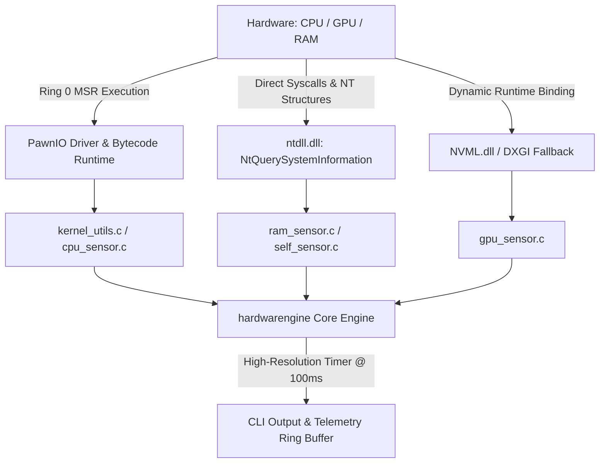

# hardwarengine

[-red.svg)](https://github.com/namazso/PawnIO)

**Microsecond-latency, zero-overhead low-level telemetry engine & in-game HUD backend for Windows x64.**

[English](README.md) • [Türkçe](README_TR.md)

## English

A low-level telemetry engine written in pure C99 designed to bypass slow, high-overhead abstractions (WMI, COM, CIM). Direct access to Ring 0 Model-Specific Registers (MSR), native Windows NT syscalls, and dynamic hardware driver bindings to extract true hardware operational metrics with near-zero latency and minimal CPU/RAM footprint.

### System Architecture & Data Flow

### Telemetry Pipeline & Metric Specifications

| Subsystem | Metric | Primary Source / Mechanism | Latency Target | Overhead |
| :--- | :--- | :--- | :--- | :--- |
| **CPU Core** | Architectural Effective Clock | MSR (`IA32_APERF` / `IA32_MPERF` normalized with `MSR_PLATFORM_INFO` or P0 Base) | Sub-microsecond | $\approx 0$ cycles |
| **CPU Thermal** | Digital Thermal Sensor (DTS) | MSR (`IA32_THERM_STATUS` / AMD `MSR_AMD_HARDWARE_THERMAL` + TjMax) | Sub-microsecond | $\approx 0$ cycles |
| **CPU Power** | RAPL Package Energy & VID | MSR (`MSR_PKG_ENERGY_STATUS` delta derivative & `IA32_PERF_STATUS` VID) | Sub-microsecond | $\approx 0$ cycles |
| **CPU Load** | Dynamic System/Core Deltas | `NtQuerySystemInformation` (`SystemProcessorPerformanceInformation`) | $< 10\,\mu\text{s}$ | Zero allocation |
| **GPU (Discrete)** | Clocks, Temp, VRAM, Power | NVML Dynamic Runtime API (`nvml.dll`) | $< 50\,\mu\text{s}$ | Dynamic load |
| **Kernel Pools** | Paged & Non-Paged Pool Sizes | `NtQuerySystemInformation` (`SystemPerformanceInformation`) | $< 5\,\mu\text{s}$ | Zero allocation |
| **System Memory** | Physical, Hardware Reserved & Commit | `GlobalMemoryStatusEx` + `GetPhysicallyInstalledSystemMemory` | $< 5\,\mu\text{s}$ | Minimal |
| **Self-Profiler** | Working Set & CPU Usage | `K32GetProcessMemoryInfo` + `GetProcessTimes` | $< 10\,\mu\text{s}$ | Self-tracking |

### Core Architectural Principles

* **Modern Kernel Bridge (PawnIO Integration):** Replaces legacy, vulnerable driver stacks (WinRing0) with **PawnIO**, fully compatible with Windows HVCI (Hypervisor-Protected Code Integrity) and Core Isolation. Ring 0 MSR reads execute directly via signed bytecode modules (`IntelMSR.bin`, `AMDFamily17.bin`) through `PawnIOLib.dll`.
* **Zero-Abstraction Pipeline:** Completely eliminates 100–300 ms delays and high context-switch penalties caused by WMI/CIM infrastructure.
* **Hybrid Core & Topology Mapping:** Scans system topology dynamically using `GetLogicalProcessorInformationEx` to map Intel Performance/Efficient (P/E) cores and AMD Zen CCX complexes on a per-thread basis.
* **Pure Architectural Effective Clocks:** Bypasses operating system target multiplier approximations. Normalizes hardware execution cycles via `MSR_PLATFORM_INFO` (`0xCE`) base bus ratio on Intel and P-State 0 (`0xC0010064`) on AMD Zen with APERF/MPERF hardware counter deltas.
* **Hardware-Grade Power Modeling:** Tracks processor package energy via hardware Running Average Power Limit (RAPL) units (`MSR_RAPL_POWER_UNIT` / `MSR_PKG_ENERGY_STATUS`), computing the true mathematical derivative ($\Delta E / \Delta t$) with `QueryPerformanceCounter` precision.
* **Deep Windows NT Memory Accounting:** Captures system hardware reserved physical address space, commit charges, page fault deltas, and kernel memory pools (Paged Pool & Non-Paged Pool) directly via native NT structures (`HW_SYSTEM_PERFORMANCE_INFO`).
* **Deterministic Kernel Timer:** Operates at 100 ms (10 Hz) using `CreateWaitableTimerExW` (High-Resolution Timer API) with an internal 2.0-second moving average accumulator.
* **Ultra-Low Resource Footprint:** Pure Win32/NT execution without external runtime dependencies (benchmarked: `< 5 MB` Working Set, `< 0.04%` CPU load).

### Subsystems Breakdown

* **CPU & Ring 0 MSR Layer**
  * Dynamically locates and links `PawnIOLib.dll` from the system registry. Locks thread affinity per physical core to execute `ioctl_read_msr`.
  * **Intel Decoding:** `0x1A2` (`IA32_TEMPERATURE_TARGET` TjMax), `0x19C` (`IA32_THERM_STATUS` DTS & PROCHOT/Power Throttling flags), `0x198` (`IA32_PERF_STATUS` VID / 8192.0f), `0x0CE` (`MSR_PLATFORM_INFO` Bus Ratio), `0x0E7`/`0x0E8` (`IA32_APERF`/`IA32_MPERF` effective frequency), `0x606` (`MSR_RAPL_POWER_UNIT`), and `0x611` (`MSR_PKG_ENERGY_STATUS`).
  * **AMD Zen Decoding:** `0xC0010064` (`MSR_AMD_PSTATE_0` FID/DID/VID decoding), `0xC0010293` (`MSR_AMD_HARDWARE_THERMAL` Tctl/Tdie offsets and thermal throttling bit), `0x0E7`/`0x0E8` (`APERF`/`MPERF`), `0xC0010299` (`MSR_AMD_RAPL_PWR_UNIT`), and `0xC001029A` (`MSR_AMD_CORE_ENERGY_STAT`).
  * **Core Load:** Direct `ntdll.dll` resolution of `NtQuerySystemInformation` (`SystemProcessorPerformanceInformation`).

* **GPU Telemetry Layer**
  * Resolves `nvml.dll` dynamically at runtime via `LoadLibraryA` / `GetProcAddress` (zero link-time dependency).
  * **NVIDIA (NVML):** Core/Memory clocks, Core/Hotspot temperatures, Fan RPM, TGP power draw (mW $\rightarrow$ W), and active VRAM allocation footprint.
  * **DirectX Fallback:** Planned failover to `dxgi.dll` (`IDXGIFactory` / `IDXGIAdapter`) for adapter identification and basic VRAM telemetry if NVML is absent.

* **Memory & Engine Self-Profiling**
  * **RAM & Kernel Allocations:** Physical RAM usage through `GlobalMemoryStatusEx`, ACPI/iGPU reserved slice calculations via `GetPhysicallyInstalledSystemMemory`, and deep kernel allocation monitoring (Paged Pool, Non-Paged Pool, Commit Total, and Commit Limit) via `NtQuerySystemInformation` (`SystemPerformanceInformation`).
  * **Engine Self-Metrics:** Built-in instrumentation tracking its own execution overhead via `GetProcessTimes` and `K32GetProcessMemoryInfo` (Working Set & Private Commit Size).

### Project Roadmap & Planned Capabilities

* [x] Ring 0 MSR CPU frequency, temperature, voltage, and throttling status extraction (Intel/AMD)
* [x] Hardware RAPL package power consumption derivative calculation ($\Delta E / \Delta t$)
* [x] Win32 high-resolution deterministic kernel timer (100 ms cadence) with moving average filter
* [x] Native NT API memory polling (Paged/Non-Paged Pools, Hardware Reserved Memory, Commit Limits)
* [ ] Runtime dynamic NVML GPU extraction layer (Core, Memory, Clocks, Temp, Power)
* [ ] DirectX DXGI / D3DKMT fallback telemetry pipeline for non-NVIDIA GPUs
* [ ] Low-overhead in-game HUD overlay via Direct3D / Vulkan swapchain hook
* [ ] Embedded Controller (EC) dynamic fan-curve & power limit orchestration
* [ ] Real-time hardware throttling and bottleneck detection engine
