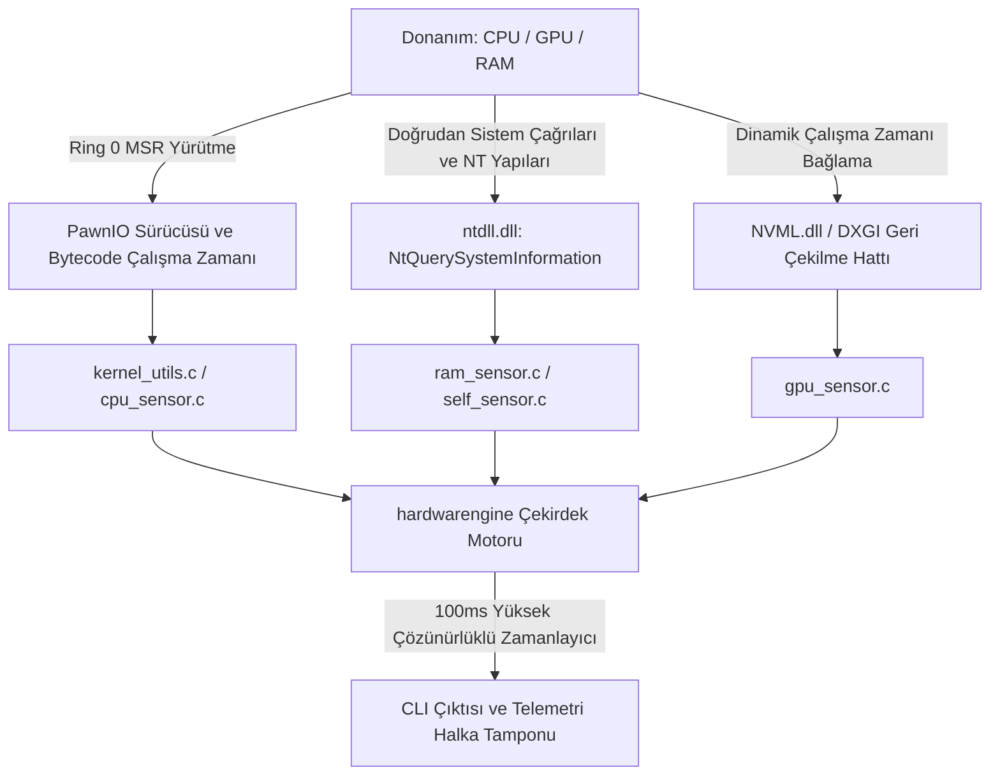

# hardwarengine

[-red.svg)](https://github.com/namazso/PawnIO)

**Windows x64 için mikrosaniye gecikmeli, sıfır ek yük getiren düşük seviyeli telemetri motoru ve oyun içi HUD arka ucu.**

[English](README.md) • [Türkçe](README_TR.md)

## Türkçe

Yavaş ve yüksek ek yük getiren soyutlamaları (WMI, COM, CIM) atlamak üzere saf C99 ile yazılmış düşük seviyeli bir telemetri motoru. Gerçek donanım çalışma metriklerini neredeyse sıfır gecikme ve minimum CPU/RAM ayak iziyle elde etmek için Ring 0 Model-Specific Register (MSR) alanlarına, yerel Windows NT sistem çağrılarına ve dinamik donanım sürücüsü bağlamalarına doğrudan erişir.

### Sistem Mimarisi ve Veri Akışı

### Telemetri Boru Hattı ve Metrik Özellikleri

| Alt Sistem | Metrik | Birincil Kaynak / Mekanizma | Hedef Gecikme | Ek Yük |
| :--- | :--- | :--- | :--- | :--- |
| **CPU Çekirdeği** | Mimari Efektif Saat Frekansı | MSR (`MSR_PLATFORM_INFO` veya P0 Tabanı ile normalize edilmiş `IA32_APERF` / `IA32_MPERF`) | Mikrosaniye altı | $\approx 0$ döngü |
| **CPU Sıcaklık** | Dijital Sıcaklık Sensörü (DTS) | MSR (`IA32_THERM_STATUS` / AMD `MSR_AMD_HARDWARE_THERMAL` + TjMax) | Mikrosaniye altı | $\approx 0$ döngü |
| **CPU Güç** | RAPL Paket Enerjisi ve VID | MSR (`MSR_PKG_ENERGY_STATUS` delta türevi ve `IA32_PERF_STATUS` VID) | Mikrosaniye altı | $\approx 0$ döngü |
| **CPU Yükü** | Dinamik Sistem/Çekirdek Farkları | `NtQuerySystemInformation` (`SystemProcessorPerformanceInformation`) | $< 10\,\mu\text{s}$ | Sıfır tahsis |
| **GPU (Ayrık)** | Saatler, Sıcaklık, VRAM, Güç | NVML Dinamik Çalışma Zamanı API'si (`nvml.dll`) | $< 50\,\mu\text{s}$ | Dinamik yük |
| **Çekirdek Havuzları** | Sayfalanan ve Sayfalanmayan Havuz Boyutları | `NtQuerySystemInformation` (`SystemPerformanceInformation`) | $< 5\,\mu\text{s}$ | Sıfır tahsis |
| **Sistem Belleği** | Fiziksel, Donanıma Ayrılmış ve İşleme Alınan | `GlobalMemoryStatusEx` + `GetPhysicallyInstalledSystemMemory` | $< 5\,\mu\text{s}$ | Minimal |
| **Öz-Profilleyici** | Çalışma Kümesi ve CPU Kullanımı | `K32GetProcessMemoryInfo` + `GetProcessTimes` | $< 10\,\mu\text{s}$ | Kendi kendini izleme |

### Temel Mimari İlkeler

* **Modern Çekirdek Köprüsü (PawnIO Entegrasyonu):** Güvenlik açıklarına sahip eski sürücü yığınlarını (WinRing0) Windows HVCI (Hipervizör Korumalı Kod Bütünlüğü) ve Çekirdek Yalıtımı ile tam uyumlu **PawnIO** ile değiştirir. Ring 0 MSR okumaları, `PawnIOLib.dll` üzerinden doğrudan imzalı bayt kodu modülleri (`IntelMSR.bin`, `AMDFamily17.bin`) aracılığıyla yürütülür.
* **Sıfır Soyutlama Boru Hattı:** WMI/CIM altyapısının neden olduğu 100–300 ms gecikmeleri ve yüksek bağlam değiştirme (context-switch) cezalarını tamamen ortadan kaldırır.
* **Hibrit Çekirdek ve Topoloji Haritalama:** İş parçacığı başına Intel Performans/Verimlilik (P/E) çekirdeklerini ve AMD Zen CCX yapılarını eşlemek için `GetLogicalProcessorInformationEx` kullanarak sistem topolojisini dinamik olarak tarar.
* **Saf Mimari Efektif Saat Frekansları:** İşletim sisteminin hedef çarpan yaklaşımlarını atlar. Intel'de `MSR_PLATFORM_INFO` (`0xCE`) temel veri yolu oranı ve AMD Zen'de P-State 0 (`0xC0010064`) ile APERF/MPERF donanım sayaç farkları üzerinden donanım yürütme döngülerini normalize eder.
* **Donanım Seviyesinde Güç Modellemesi:** İşlemci paketi enerjisini donanımsal Çalışma Ortalaması Güç Sınırı (RAPL) birimleri (`MSR_RAPL_POWER_UNIT` / `MSR_PKG_ENERGY_STATUS`) üzerinden takip eder; gerçek matematiksel türevi ($\Delta E / \Delta t$) `QueryPerformanceCounter` hassasiyetiyle hesaplar.
* **Derin Windows NT Bellek Muhasebesi:** Sistemin donanıma ayrılmış fiziksel adres alanını, işleme sınırlarını (commit charges), sayfa hatası farklarını ve çekirdek bellek havuzlarını (Paged Pool ve Non-Paged Pool) doğrudan yerel NT yapıları (`HW_SYSTEM_PERFORMANCE_INFO`) üzerinden yakalar.
* **Deterministik Çekirdek Zamanlayıcısı:** Dahili 2.0 saniyelik hareketli ortalama akümülatörü ile `CreateWaitableTimerExW` (Yüksek Çözünürlüklü Zamanlayıcı API) kullanarak 100 ms (10 Hz) frekansta çalışır.
* **Ultra Düşük Kaynak Ayak İzi:** Harici çalışma zamanı bağımlılıkları olmadan saf Win32/NT yürütümü (kıyaslama: `< 5 MB` Çalışma Kümesi, `< 0.04%` CPU yükü).

### Alt Sistem Detayları

* **CPU ve Ring 0 MSR Katmanı**
  * `PawnIOLib.dll` dosyasını sistem kayıt defterinden dinamik olarak bulur ve bağlar. `ioctl_read_msr` yürütmek için iş parçacığı eğilimini (affinity) fiziksel çekirdek başına kilitler.
  * **Intel Çözümleme:** `0x1A2` (`IA32_TEMPERATURE_TARGET` TjMax), `0x19C` (`IA32_THERM_STATUS` DTS ve PROCHOT/Güç Kısma bayrakları), `0x198` (`IA32_PERF_STATUS` VID / 8192.0f), `0x0CE` (`MSR_PLATFORM_INFO` Veri Yolu Oranı), `0x0E7`/`0x0E8` (`IA32_APERF`/`IA32_MPERF` efektif frekans), `0x606` (`MSR_RAPL_POWER_UNIT`) ve `0x611` (`MSR_PKG_ENERGY_STATUS`).
  * **AMD Zen Çözümleme:** `0xC0010064` (`MSR_AMD_PSTATE_0` FID/DID/VID çözümleme), `0xC0010293` (`MSR_AMD_HARDWARE_THERMAL` Tctl/Tdie sapmaları ve termal kısma biti), `0x0E7`/`0x0E8` (`APERF`/`MPERF`), `0xC0010299` (`MSR_AMD_RAPL_PWR_UNIT`) ve `0xC001029A` (`MSR_AMD_CORE_ENERGY_STAT`).
  * **Çekirdek Yükü:** `NtQuerySystemInformation` (`SystemProcessorPerformanceInformation`) çağrısının `ntdll.dll` üzerinden doğrudan çözümlenmesi.

* **GPU Telemetry Katmanı**
  * `nvml.dll` kütüphanesini çalışma zamanında `LoadLibraryA` / `GetProcAddress` ile dinamik olarak bağlar (sıfır derleme zamanı bağımlılığı).
  * **NVIDIA (NVML):** Çekirdek/Bellek frekansları, Çekirdek/Hotspot sıcaklıkları, Fan devri, TGP güç tüketimi (mW $\rightarrow$ W) ve aktif VRAM tahsis ayak izi.
  * **DirectX Geri Çekilme Hattı:** NVML bulunmadığında bağdaştırıcı tanımlama ve temel VRAM telemetrisi için planlanan `dxgi.dll` (`IDXGIFactory` / `IDXGIAdapter`) geri çekilme hattı.

* **Bellek ve Motor Öz-Profilleme**
  * **RAM ve Çekirdek Tahsisleri:** `GlobalMemoryStatusEx` ile fiziksel RAM kullanımı, `GetPhysicallyInstalledSystemMemory` üzerinden ACPI/iGPU ayrılmış dilim hesaplamaları ve `NtQuerySystemInformation` (`SystemPerformanceInformation`) üzerinden derin çekirdek tahsis izleme (Sayfalanan Havuz, Sayfalanmayan Havuz, Toplam İşleme ve İşleme Sınırı).
  * **Motor Öz Metrikleri:** Kendi yürütme ek yükünü `GetProcessTimes` ve `K32GetProcessMemoryInfo` (Çalışma Kümesi ve Özel İşleme Boyutu) üzerinden izleyen yerleşik enstrümantasyon.

### Proje Yol Haritası ve Planlanan Özellikler

* [x] Ring 0 MSR CPU frekansı, sıcaklık, voltaj ve kısma durumu çıkarımı (Intel/AMD)
* [x] Donanım RAPL paket güç tüketimi türev hesabı ($\Delta E / \Delta t$)
* [x] Hareketli ortalama filtreli Win32 yüksek çözünürlüklü deterministik çekirdek zamanlayıcısı (100 ms kadans)
* [x] Yerel NT API bellek yoklaması (Sayfalanan/Sayfalanmayan Havuzlar, Donanıma Ayrılmış Bellek, İşleme Sınırları)
* [ ] Çalışma zamanı dinamik NVML GPU çıkarma katmanı (Çekirdek, Bellek, Frekanslar, Sıcaklık, Güç)
* [ ] NVIDIA dışı GPU'lar için DirectX DXGI / D3DKMT geri çekilme telemetri boru hattı
* [ ] Direct3D / Vulkan swapchain kancası (hook) üzerinden düşük ek yüklü oyun içi HUD katmanı
* [ ] Gömülü Denetleyici (EC) dinamik fan eğrisi ve güç sınırı orkestrasyonu
* [ ] Gerçek zamanlı donanım darboğazı ve termal/güç kısma algılama motoru
