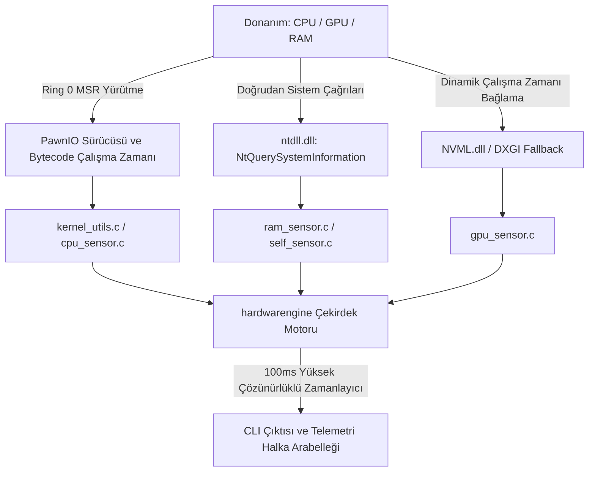

# hardwarengine

[-red.svg)](https://github.com/namazso/PawnIO)

**Windows x64 için mikrosaniye gecikmeli, sıfır maliyetli düşük seviyeli telemetri motoru ve oyun içi HUD arka ucu.**

[English](README.md) • **Türkçe**

---

WMI, COM veya CIM gibi hantal ve yüksek ek yüke sahip soyutlama katmanlarını tamamen bypass eden, saf C99 ile yazılmış düşük seviyeli telemetri motoru. Ring 0 Model-Specific Registers (MSR), yerel Windows NT sistem çağrıları ve dinamik donanım sürücü bağlantıları üzerinden gerçek donanım metriklerini mikrosaniye gecikmeyle, minimum bellek ve işlemci kullanımıyla toplar.

### Sistem Mimarisi ve Veri Akışı

### Telemetri Katmanı ve Metrik Özellikleri

| Alt Sistem | Metrik | Öncelikli Kaynak / Yöntem | Hedef Gecikme | Ek Yük / Maliyet |
| --- | --- | --- | --- | --- |
| **CPU Çekirdek** | Efektif Saat Hızı | MSR (`IA32_APERF` / `IA32_MPERF`) | Sub-microsecond | $\approx 0$ çevrim |
| **CPU Sıcaklık** | Çekirdek / Paket Sıcaklığı | MSR (`IA32_THERM_STATUS` + TjMax) | Sub-microsecond | $\approx 0$ çevrim |
| **CPU Voltaj** | Anlık Çekirdek VID | MSR (`IA32_PERF_STATUS` / AMD P-State) | Sub-microsecond | $\approx 0$ çevrim |
| **CPU Yük** | Kernel / User Deltası | `NtQuerySystemInformation` (Native NT API) | $< 10\,\mu\text{s}$ | Sıfır bellek tahsisi |
| **GPU (Harici)** | Frekans, Sıcaklık, VRAM, Güç | Dinamik NVML API Bağlantısı (`nvml.dll`) | $< 50\,\mu\text{s}$ | Dinamik yükleme |
| **Sistem Belleği** | Fiziksel RAM Kullanımı / Boş Alan | `GlobalMemoryStatusEx` | $< 5\,\mu\text{s}$ | Minimal |
| **Süreç Öz-İzleme** | Working Set ve CPU Kullanımı | `K32GetProcessMemoryInfo` + `GetProcessTimes` | $< 10\,\mu\text{s}$ | Öz-izleme |

### Temel Mimari Prensipler

* **Modern Kernel Köprüsü (PawnIO Entegrasyonu):** Eski ve güvenlik açığı barındıran sürücü yapıları (WinRing0 vb.) yerine Windows HVCI (Hypervisor-Protected Code Integrity) ve Çekirdek Yalıtım (Core Isolation) ile tam uyumlu modern **PawnIO** altyapısı kullanılır. Ring 0 MSR okumaları, `PawnIOLib.dll` üzerinden doğrudan yürütülebilir imzalı bytecode modülleri (`IntelMSR.bin`, `AMDFamily17.bin`) ile donanıma güvenle iletilir.
* **Sıfır Soyutlama Katmanı:** WMI/CIM altyapısının getirdiği 100–300 ms gecikmeyi ve yüksek bağlam değiştirme (context switch) maliyetini tamamen ortadan kaldırır.
* **Hibrit Çekirdek ve Topoloji Haritalama:** `GetLogicalProcessorInformationEx` ile sistem topolojisi dinamik taranarak Intel Performans/Verimlilik (P/E) çekirdekleri ve AMD Zen CCX blokları iş parçacığı (thread) bazında haritalanır.
* **Deterministik Kernel Zamanlayıcı:** `CreateWaitableTimerExW` (Yüksek Çözünürlüklü Zamanlayıcı API) ile 100 ms (10 Hz) periyotla çalışır ve dahili 2.0 saniyelik hareketli ortalama filtresi uygular.
* **Ultra Düşük Kaynak Tüketimi:** Dış çalışma zamanı bağımlılığı olmadan saf Win32/NT çağrılarıyla çalışır (hedef: `< 2 MB` Working Set, `< %0.05` CPU yükü).

### Alt Sistem Detayları

* **CPU ve Ring 0 MSR Katmanı:**
* Windows Kayıt Defteri üzerinden `PawnIOLib.dll` dinamik olarak tespit edilip bağlanır. Fiziksel çekirdek başına thread affinity kilitlenerek `ioctl_read_msr` çalıştırılır.
* **Intel Çözümleme:** `0x1A2` (`IA32_TEMPERATURE_TARGET` TjMax), `0x19C` (`IA32_THERM_STATUS` DTS ve PROCHOT), `0x198` (`IA32_PERF_STATUS` VID), `0x0E7`/`0x0E8` (`IA32_APERF`/`IA32_MPERF` gerçek efektif frekans).
* **AMD Zen Çözümleme:** `0xC0010064` (`MSR_AMD_PSTATE_0` çarpanları), `0xC0010293` (`MSR_AMD_HARDWARE_THERMAL` Tctl/Tdie sapmaları).
* **Çekirdek Yükü:** `ntdll.dll` içerisinden doğrudan çözülen `NtQuerySystemInformation` (`SystemProcessorPerformanceInformation`) ile çekirdek/kullanıcı delta analizi.

* **GPU Telemetri Katmanı:**
* Bağlama zamanı `.lib` bağımlılığı olmadan çalışma anında `LoadLibraryA` / `GetProcAddress` üzerinden `nvml.dll` çözülür.
* **NVIDIA (NVML):** Çekirdek/Bellek frekansları, Çekirdek/Hotspot sıcaklıkları, Fan devri (RPM), güç tüketimi (mW) ve aktif VRAM kullanımı.
* **DirectX Fallback:** NVML bulunamayan sistemlerde bağdaştırıcı tespiti ve temel VRAM telemetrisi için `dxgi.dll` (`IDXGIFactory` / `IDXGIAdapter`) katmanına otomatik geçiş.

* **Bellek ve Motor Öz-İzleme (Self-Profiling):**
* **RAM:** `GlobalMemoryStatusEx` ile fiziksel bellek sınırları ve anlık sistem bellek yükü takibi.
* **Motorun Kendi Metrikleri:** Motorun sisteme getirdiği yükü doğrulamak için `GetProcessTimes` ve `K32GetProcessMemoryInfo` (Working Set & Private Commit Size) üzerinden gerçek zamanlı izleme.

### Yol Haritası ve Planlanan Yetenekler

* [x] Ring 0 MSR CPU frekansı, sıcaklığı ve voltaj okuması (Intel/AMD)
* [x] Win32 yüksek çözünürlüklü deterministik kernel zamanlayıcı (100 ms döngü)
* [x] Yerel NT API bellek ve kullanım analitiği
* [ ] Çalışma zamanı dinamik NVML ve DXGI GPU telemetri katmanı
* [ ] Direct3D / Vulkan tabanlı düşük ek yüklü oyun içi HUD (Overlay)
* [ ] Gömülü Denetleyici (EC) üzerinden dinamik fan eğrisi ve güç limiti yönetimi
* [ ] Gerçek zamanlı donanım kısıtlaması ve darboğaz (Throttling/Bottleneck) analizörü

---
